<h2>TensorFlow-FlexUNet-Image-Segmentation-RISE-MICCAI-LISA-Hippocampus-T2W (2026/04/11)</h2>
Sarah T. Arai 
Software Laboratory antillia.com  
This is the first experiment of Image Segmentation for <b>RISE MICCAI LISA </b>
(<b>L</b>ow field pediatric brain magnetic resonance <b>I</b>mage <b>S</b>egmentation and quality <b>A</b>ssurance)
) <b>Hippocampus T2W</b>
 based on our <a href="./src/TensorFlowFlexUNet.py">TensorFlowFlexUNet</a>
 (<b>TensorFlow Flexible UNet Image Segmentation Model for Multiclass</b>), and a 394x466 pixels upscaled PNG
 <a href="https://drive.google.com/file/d/1-pFytpRqwgKQxPbTnvyJpNAPr8l8b95G/view?usp=sharing">
RISE-MICCAI-LISA-Hippocampus-T2W-ImageMask-Dataset.zip</a>, which was derived by us from   
<a href="https://www.kaggle.com/datasets/tjahan/subtask-2a-hippocampus-segmentations">
<b>Subtask 2a - Hippocampus Segmentations</b>
</a> on the kaggle.com
  

<b>Actual Image Segmentation for LISA-Hippocampus-T2W Images of 394x466 pixels</b> 
As shown below, the inferred masks predicted by our segmentation model trained by the dataset appear similar to the 
ground truth masks.
  
<b> class_color_map = {Right hippocampus:red,  Left hippocampus:green }</b>
  
<table>
<tr>
<th>Input: image</th>
<th>Mask (ground_truth)</th>
<th>Prediction: inferred_mask</th>
</tr>
<tr>
<td>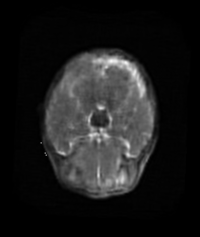</td>
<td></td>
<td></td>
</tr>

<tr>
<td>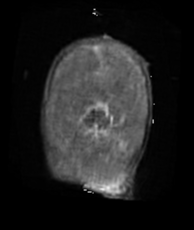</td>
<td></td>
<td></td>
</tr>

<tr>
<td>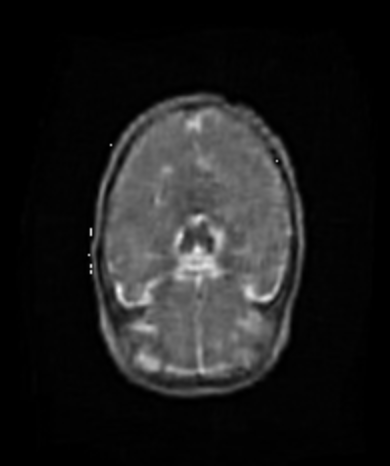</td>
<td>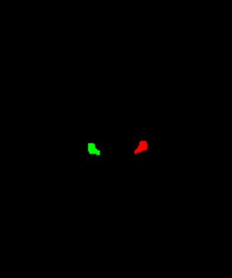</td>
<td></td>
</tr>
</table>

 
<h3>1. Dataset Citation</h3>
The dataset used here was taken from   
<a href="https://www.kaggle.com/datasets/tjahan/subtask-2a-hippocampus-segmentations">
<b>Subtask 2a - Hippocampus Segmentations</b> 
<b>RISE MICCAI Dataset ch</b>
</a> on the kaggle.com
  
For more information on <b>RISE MICCAL</b> and <b>LISA</b>, 
please refer to the following web site: 
<ul>
<li><a href="https://miccai.org/index.php/about-miccai/rise-miccai/">RISE-MICCAI</a>
</li>
<li> 
<a href="https://www.synapse.org/Synapse:syn55249552/wiki/627178">LISA 2024/2.Segmentation</a>
</li>
<li>
<a href="https://zenodo.org/records/15081583">Low field pediatric brain magnetic resonance Image Segmentation and quality Assurance (LISA)</a>
</li>
</ul>

The following explanation was taken from the above <a href="https://www.synapse.org/Synapse:syn55249552/wiki/627178">LISA 2024/2.Segmentation</a>
 web site.  
The challenge of automatic segmentation in low-field MRI environments poses a significant hurdle, 
particularly in regions with limited resources where high-field MRI systems are scarce.  
Structural delineation becomes even more challenging due to the lower resolution of accessible systems like 
the 0.064T Hyperfine scanner. Despite these obstacles, the benefits of utilizing low-field MRI, 
such as portability and reduced clinical costs, are undeniable, especially in settings where sedation 
for young patients is impractical.
  
Addressing this segmentation challenge head-on, the LISA challenge introduces its second task.
Participants are called upon to pioneer deep learning methods tailored for automatically segmenting the bilateral 
hippocampi in ultra low-field (0.064T) T2-weighted MRI images of early childhood brains.  
The bilateral hippocampi play a critical role in cognitive and memory functions, 
making their accurate segmentation essential for understanding abnormal neurodevelopment.
  
<b>License</b> 
Unknown (on the kaggle web site)
 
 
<h3>
<a id="2">
2 LISA-Hippocampus-T2W ImageMask Dataset
</a>
</h3>
<h3>2.1 Download ImageMask Dataset</h3>
 If you would like to train this LISA-Hippocampus-T2W Segmentation model by yourself,
 please download the dataset from the google drive  
<a href="https://drive.google.com/file/d/1-pFytpRqwgKQxPbTnvyJpNAPr8l8b95G/view?usp=sharing">
RISE-MICCAI-LISA-Hippocampus-T2W-ImageMask-Dataset.zip</a>, expand the downloaded ImageMaskDataset and put it under <b>./dataset</b> folder to be
 
<pre>
./dataset
└─LISA-Hippocampus-T2W
    ├─test
    │   ├─images
    │   └─masks
    ├─train
    │   ├─images
    │   └─masks
    └─valid
        ├─images
        └─masks
</pre>
 
<b>LISA-Hippocampus-T2W Statistics</b> 
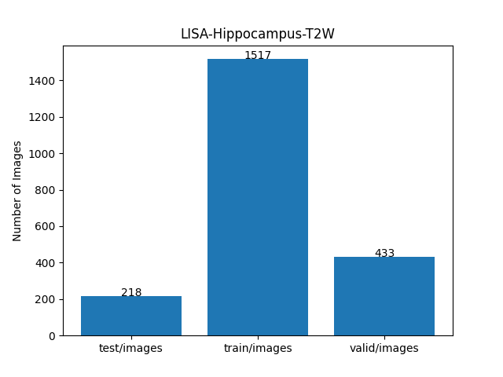 
  
As shown above, the number of images of train and valid datasets is not so large to use for the
 training set of our segmentation model.
  
<h3>2.2 Derivation PNG dataset</h3>
The folder structure of the original dataset is the following. 
<pre>
./archive
├─Low Field Images
│  ├─LISA_0001_ciso.nii
...
│  └─LISA_1016_ciso.nii
├─Subtask 2a - Hippocampus Segmentations
│  ├─LISA_0001_HF_hipp.nii
...
│  └─LISA_1016_HF_hipp.nii
└─Task 2 - Segmentation Validation
    ├─LISA_VALIDATION_0001_ciso.nii
...
    └─LISA_VALIDATION_0012_ciso.nii

</pre>

We used a simple Python script to generate the upscaled PNG  dataset from the following Image and Segmentation NIfTI files
of 79 subjects: 
<pre>
<b>Low Field Images/LISA_*_ciso.nii</b>
<b>Subtask 2a - Hippocampus Segmentations/LISA_*_HF_hipp.nii</b>
</pre>
 
We excluded all empty black masks and their corresponding images to generate the PNG dataset, 
which were irrelevant to train our segmentation model, and upscaled all images and masks to 394x466 pixels.
 
<h3>2.3 Train Image and Mask Saｍples</h3>
<b>Train_images_sample</b> 
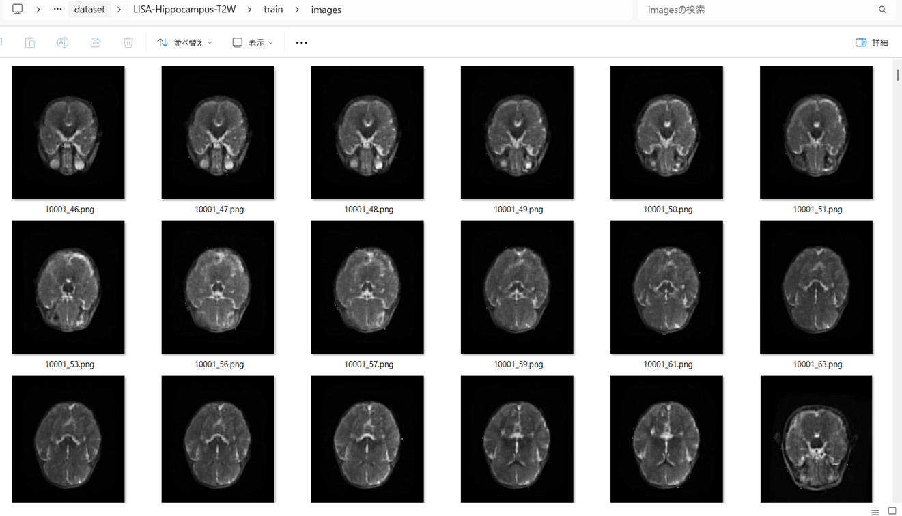
 
<b>Train_masks_sample</b> 
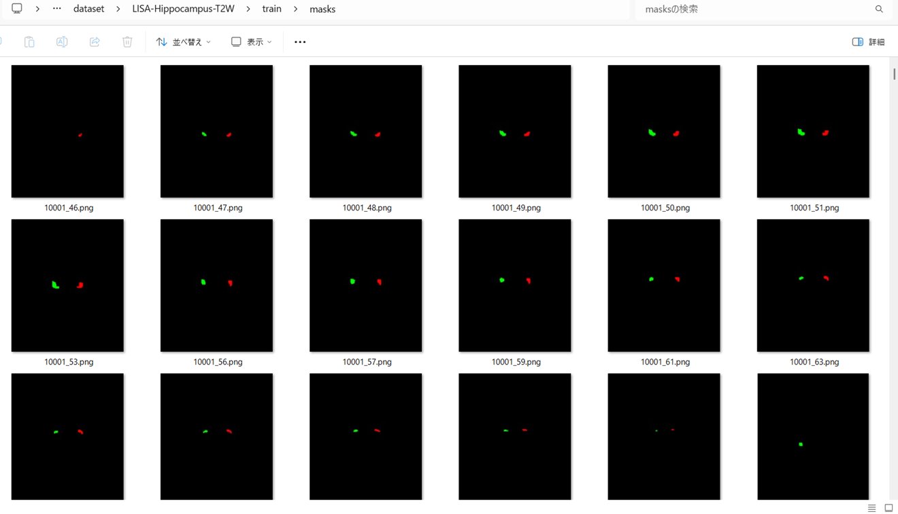
 
 
<h3>
3 Train TensorFlowFlexUNet Model
</h3>
 We trained LISA-Hippocampus-T2W TensorFlowFlexUNet Model by using the 
<a href="./projects/TensorFlowFlexUNet/LISA-Hippocampus-T2W/train_eval_infer.config"> <b>train_eval_infer.config</b></a> file.  
Please move to ./projects/TensorFlowFlexUNet/LISA-Hippocampus-T2W and run the following bat file. 
<pre>
>1.train.bat
</pre>
, which simply runs the following command. 
<pre>
>python ../../../src/TensorFlowFlexUNetTrainer.py ./train_eval_infer.config
</pre>

<b>Model parameters</b> 
Defined a small <b>base_filters = 16 </b> and large <b>base_kernels = (11,11)</b> for the first Conv Layer of Encoder Block of 
<a href="./src/TensorFlowFlexUNet.py">TensorFlowFlexUNet.py</a> 
and a large num_layers (including a bridge between Encoder and Decoder Blocks).
<pre>
[model]
;You may specify your own UNet class derived from our TensorFlowFlexModel
model         = "TensorFlowFlexUNet"
image_width    = 512
image_height   = 512
image_channels = 3
input_normalize = True
normalization  = False
num_classes    = 5
base_filters   = 16
base_kernels   = (11,11)
num_layers     = 8
dropout_rate   = 0.05
dilation       = (1,1)
</pre>
<b>Learning rate</b> 
Defined a small learning rate.  
<pre>
[model]
learning_rate  = 0.00007
</pre>
<b>Loss and metrics functions</b> 
Specified "categorical_crossentropy" and <a href="./src/dice_coef_multiclass.py">"dice_coef_multiclass"</a>. 
<pre>
[model]
loss           = "categorical_crossentropy"
metrics        = ["dice_coef_multiclass"]
</pre>
<b>Dataset class</b> 
Specifed <a href="./src/ImageCategorizedMaskDataset.py">ImageCategorizedMaskDataset</a> class. 
<pre>
[dataset]
class_name    = "ImageCategorizedMaskDataset"
</pre>
 
<b>Learning rate reducer callback</b> 
Enabled learing_rate_reducer callback, and a small reducer_patience.
<pre> 
[train]
learning_rate_reducer = True
reducer_factor     = 0.4
reducer_patience   = 4
</pre>
<b>Early stopping callback</b> 
Enabled early stopping callback with patience parameter.
<pre>
[train]
patience      = 10
</pre>
<b>RGB Color map</b> 
Specifed rgb color map dict for LISA-Hippocampus-T2W 1+2 classes. 
<pre>
[mask]
mask_datatyoe    = "categorized"
mask_file_format = ".png"
;LISA-Hippocampus-T2W rgb color map dict for 1+2 classes.
rgb_map = {(0,0,0):0, (255,0,0):1,(0,255,0):2, }
</pre>
<b>Epoch change inference callback</b> 
Enabled <a href="./src/EpochChangeInferencer.py">epoch_change_infer callback</a></b>. 
<pre>
[train]
epoch_change_infer       = True
epoch_change_infer_dir   =  "./epoch_change_infer"
num_infer_images         = 6
</pre>
By using this callback, on every epoch_change, the inference procedure can be called
 for 6 images in <b>mini_test</b> folder. This will help you confirm how the predicted mask changes 
 at each epoch during your training process.  
  
As shown below, early in the model training, the predicted masks from our UNet segmentation model showed 
discouraging results.
 However, as training progressed through the epochs, the predictions gradually improved. 
   
 
<b>Epoch_change_inference output at starting (epoch 1,2,3)</b> 
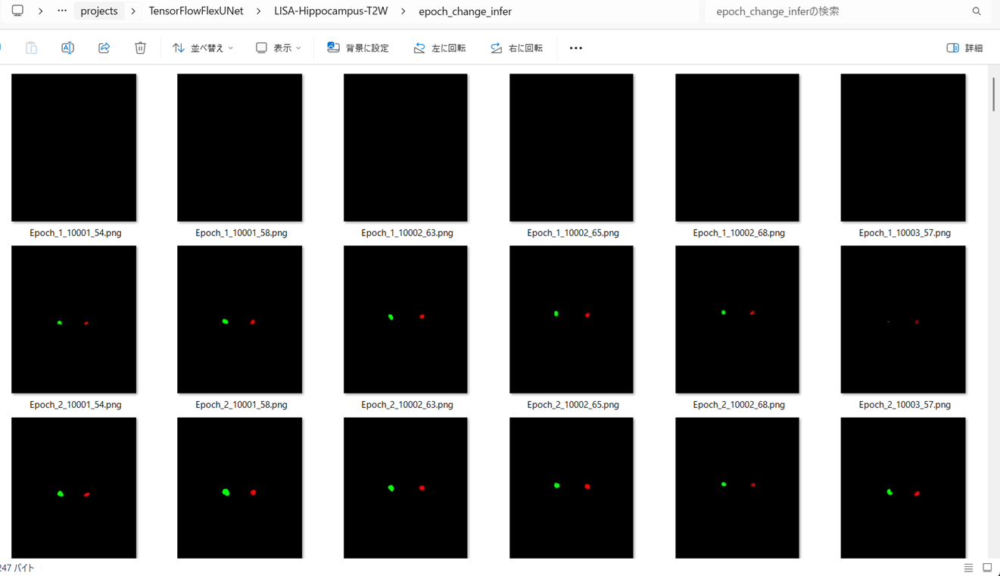 
 
<b>Epoch_change_inference output at middlepoint (epoch 18,19,20)</b> 
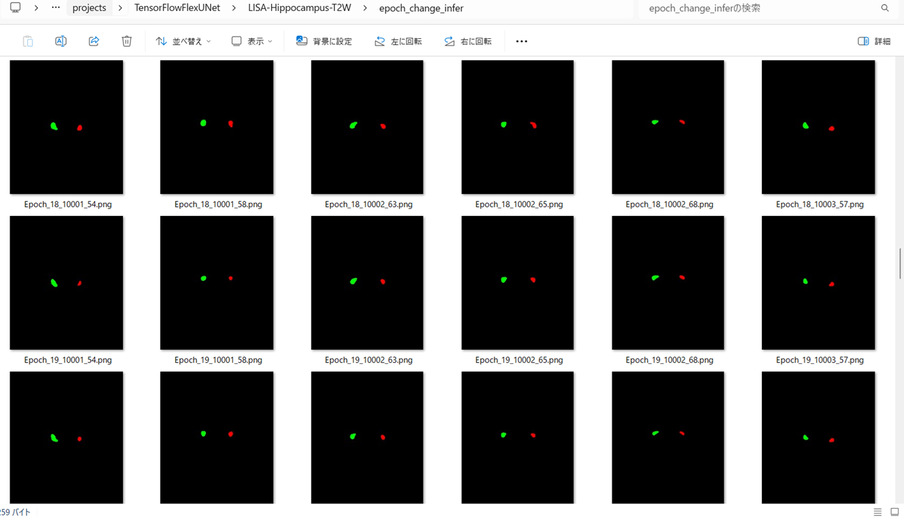 
 

<b>Epoch_change_inference output at ending (epoch 38,39,40)</b> 
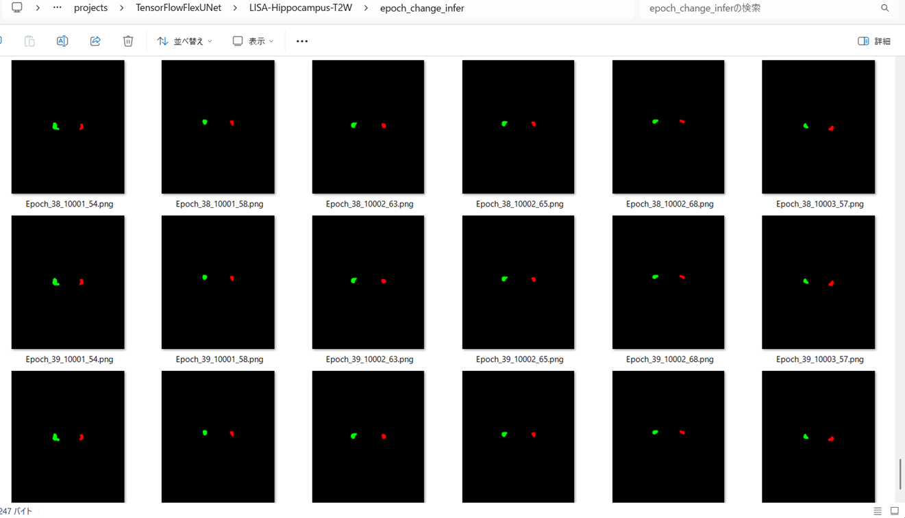 
 

In this experiment, the training process was terminated at epoch 40.  
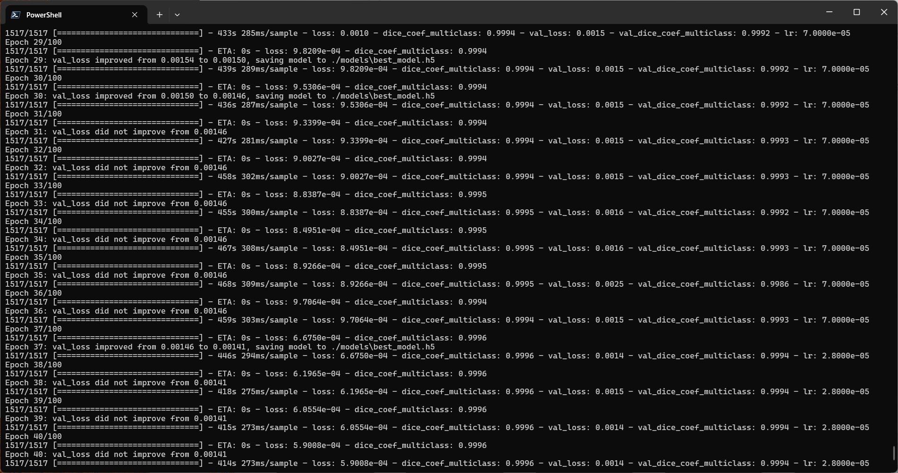 
 

<a href="./projects/TensorFlowFlexUNet/LISA-Hippocampus-T2W/eval/train_metrics.csv">train_metrics.csv</a> 
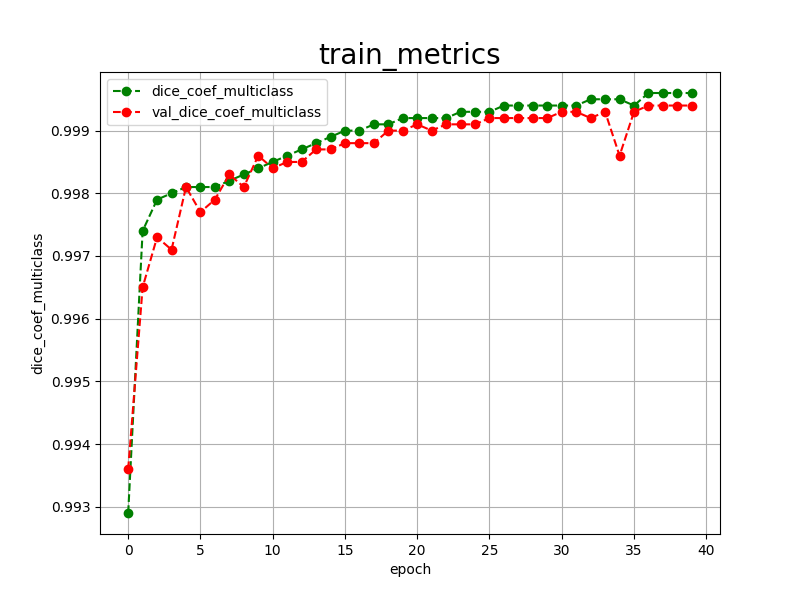 

 
<a href="./projects/TensorFlowFlexUNet/LISA-Hippocampus-T2W/eval/train_losses.csv">train_losses.csv</a> 
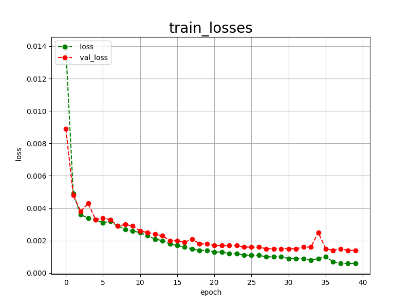 
 
<h3>
4 Evaluation
</h3>
Please move to <b>./projects/TensorFlowFlexUNet/LISA-Hippocampus-T2W</b> folder, 
and run the following bat file to evaluate TensorFlowUNet model for LISA-Hippocampus-T2W. 
<pre>
./2.evaluate.bat
</pre>
This bat file simply runs the following command.
<pre>
python ../../../src/TensorFlowFlexUNetEvaluator.py ./train_eval_infer_aug.config
</pre>

Evaluation console output: 
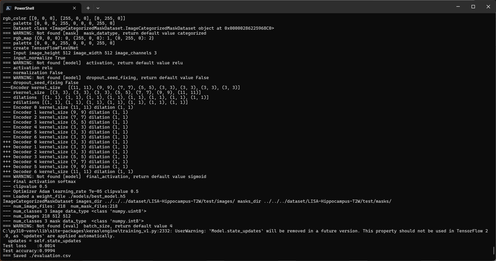
  Image-Segmentation-LISA-Hippocampus-T2W

<a href="./projects/TensorFlowFlexUNet/LISA-Hippocampus-T2W/evaluation.csv">evaluation.csv</a> 
The loss (categorical_crossentropy) to this <b>LISA-Hippocampus-T2W/test</b> was low, and dice_coef_multiclass was high as shown below.
 
<pre>
categorical_crossentropy,0.0014
dice_coef_multiclass,0.9994
</pre>
 
<h3>
5 Inference
</h3>
Please move to a <b>./projects/TensorFlowFlexUNet/LISA-Hippocampus-T2W</b> folder, and run the following bat file to infer segmentation regions for images by the Trained-TensorFlowUNet model for LISA-Hippocampus-T2W. 
<pre>
./3.infer.bat
</pre>
This simply runs the following command.
<pre>
python ../../../src/TensorFlowFlexUNetInferencer.py ./train_eval_infer_aug.config
</pre>

<b>mini_test_images</b> 
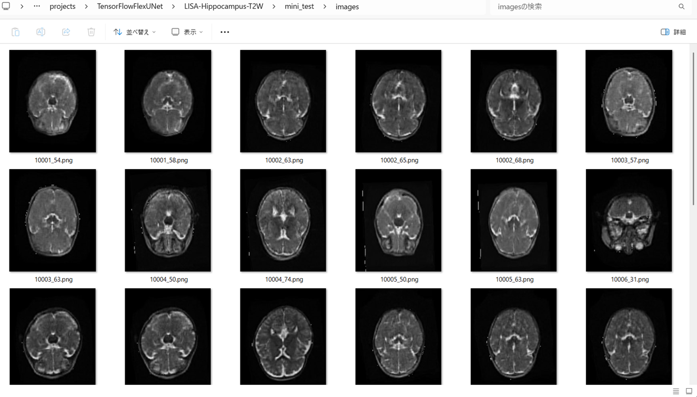 
<b>mini_test_mask(ground_truth)</b> 
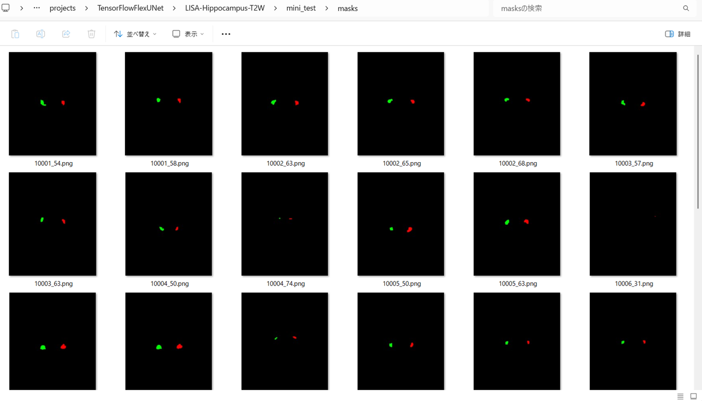 

<b>Inferred test masks</b> 
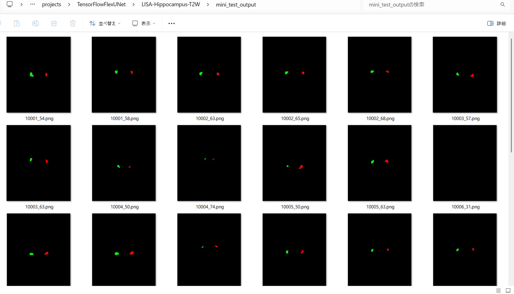 
 

<b>Enlarged images and masks of LISA-Hippocampus-T2W Images of 394x466 pixels</b> 
As shown below, the inferred masks predicted by our segmentation model trained by the dataset appear similar to the ,
ground truth masks.
  
<b> class_color_map = {Right hippocampus:red,  Left hippocampus:green }</b>
  
<table>
<tr>
<th>Image</th>
<th>Mask (ground_truth)</th>
<th>Inferred-mask</th>
</tr>
<tr>
<td>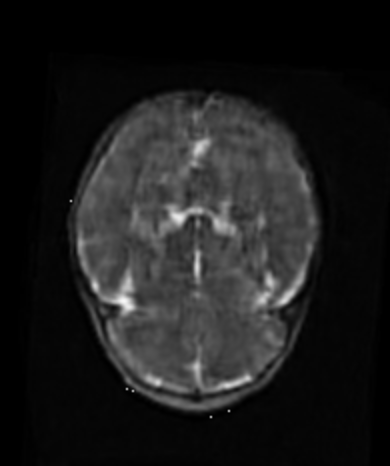</td>
<td></td>
<td>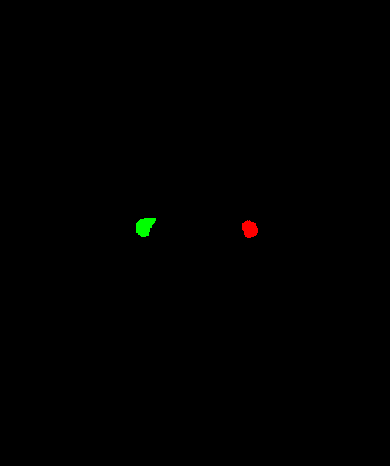</td>
</tr>

<tr>
<td>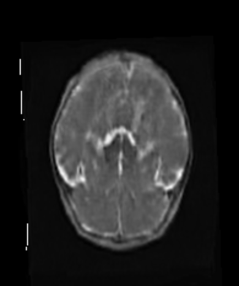</td>
<td></td>
<td>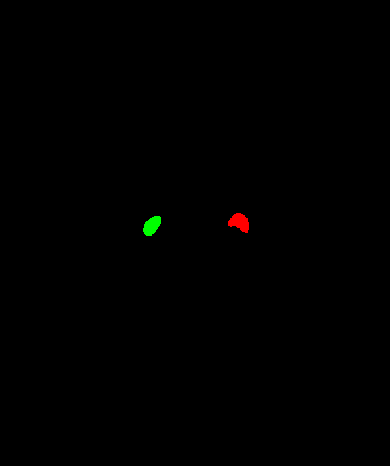</td>
</tr>

<tr>
<td>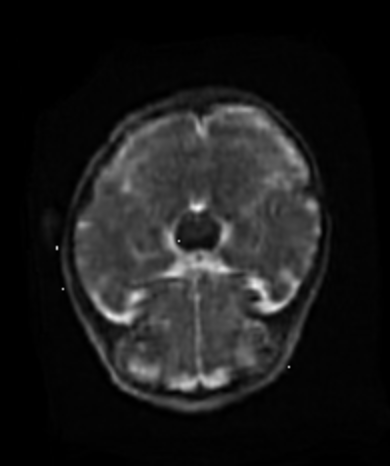</td>
<td></td>
<td></td>
</tr>

<tr>
<td>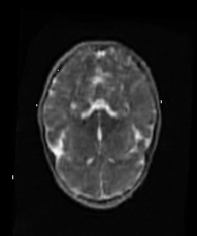</td>
<td></td>
<td></td>
</tr>

<tr>
<td>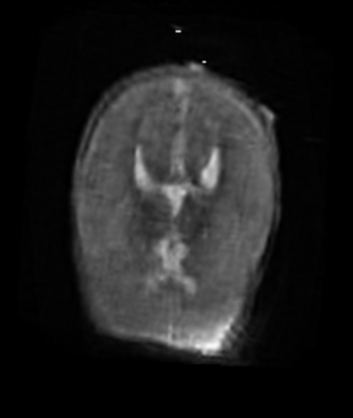</td>
<td></td>
<td></td>
</tr>

<tr>
<td>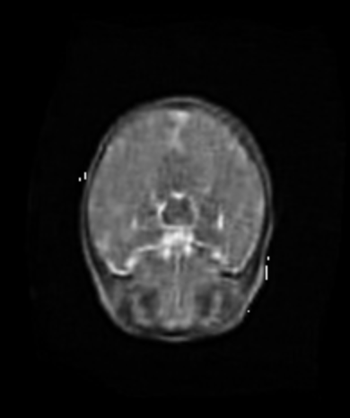</td>
<td></td>
<td></td>
</tr>
</table>

 
<h3>
References
</h3>
<b>1. Quality Assurance and Hippocampal Segmentation on Low-Field Pediatric Magnetic Resonance Images</b> 
Austin Tapp, Rahimeh Rouhi, Jeffrey Tanedo, Shreyash Zanjal, Sean Deoni, Marius George Linguraru & Natasha Lepore 
<a href="https://link.springer.com/chapter/10.1007/978-3-031-83008-2_6">
https://link.springer.com/chapter/10.1007/978-3-031-83008-2_6
</a>
  
<b>2.  Hippocampus Segmentation Using U-Net Convolutional Network from Brain Magnetic Resonance Imaging (MRI)</b> 
Ruhul Amin Hazarika, Arnab Kumar Maji, Raplang Syiem, Samarendra Nath Sur, Debdatta Kandar  
<a href="https://pmc.ncbi.nlm.nih.gov/articles/PMC9485390/">
https://pmc.ncbi.nlm.nih.gov/articles/PMC9485390/</a>
  
<b>3. Fully Automated Hippocampus Segmentation using T2-informed Deep Convolutional Neural Networks</b> 
Maximilian Sackl, Christian Tinauer, Martin Urschler, Christian Enzinger, Rudolf Stollberger, Stefan Ropele  
<a href="https://www.sciencedirect.com/science/article/pii/S1053811924002647">
https://www.sciencedirect.com/science/article/pii/S1053811924002647</a>
  
<b>4. TensorFlow-FlexUNet-Image-Segmentation-Hippocampus-T1W</b> 
Toshiyuki Arai  
<a href="https://github.com/sarah-antillia/TensorFlow-FlexUNet-Image-Segmentation-Hippocampus-T1W">
https://github.com/sarah-antillia/TensorFlow-FlexUNet-Image-Segmentation-Hippocampus-T1W
</a>
 
 
<b>5. TensorFlow-FlexUNet-Image-Segmentation-Model</b> 
Toshiyuki Arai  
<a href="https://github.com/sarah-antillia/TensorFlow-FlexUNet-Image-Segmentation-Model">
TensorFlow-FlexUNet-Image-Segmentation-Model
</a>
 
 
